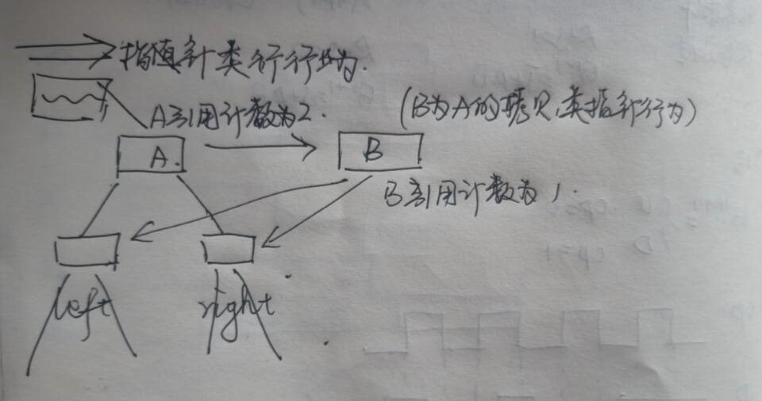
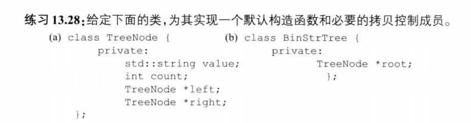
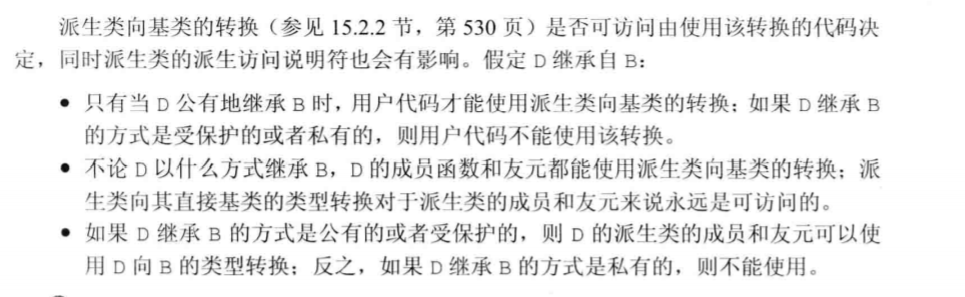
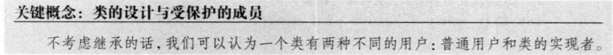
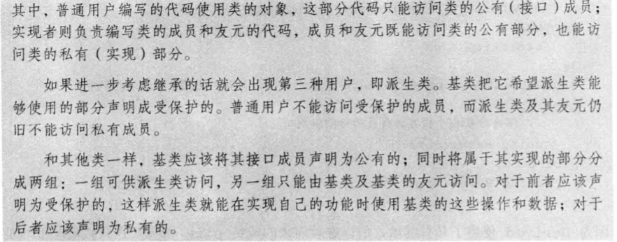
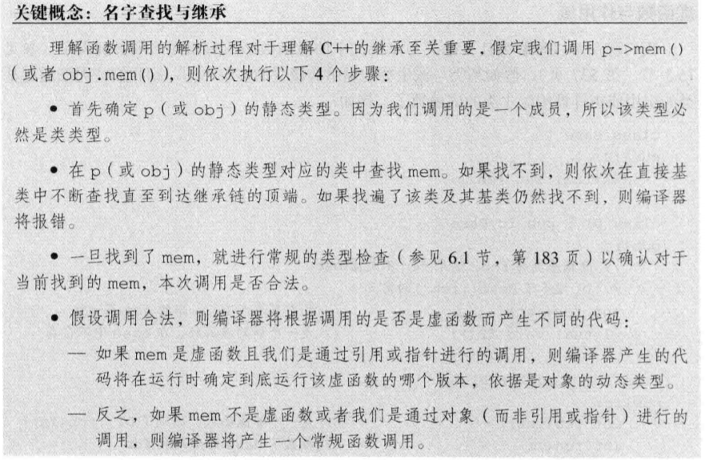

# 如何理解类值行为和类指针行为？
## 行为像值的类
为了提供类值的行为，对于**类管理的资源，每个对象都应该拥有一份自己的拷贝**。
```cpp
class HasPtr{
public:
    //some functions
private:
    std::string *ps;
    int i;
}
```
那么对于`HasPtr`类来说，为了实现类值行为，HasPtr需要：
- 定义一个拷贝构造函数，拷贝string的值，而不是拷贝指针。
- 定义一个析构函数来释放string
- 定义一个拷贝赋值运算符来释放对象当前的string，并从右侧对象拷贝string。

### 类值拷贝复制元素赋值运算符
&emsp;&emsp;赋值运算符通常**组合了析构函数和构造函数的操作**，类似析构函数，赋值操作会销毁左侧运算对象的资源。类似拷贝构造函数，赋值操作会从右侧运算对象拷贝数据。  
这些操作都是以正确的顺序执行的，即使将**一个对象赋予自身，也能保证正确**。


## 行为像指针的类
&emsp;&emsp;定义拷贝构造函数和拷贝赋值运算符，来拷贝**指针成员本身而不是它指向的string**。类仍需要自己的析构函数来释放接受string参数的构造函数分配的内存，但是不能单方面的释放关联的string，只有**最后一个指向string的HasPtr销毁时参考一释放string**。  
&emsp;&emsp;令一个类**展现指针的最好方法就是使用`shared+ptr`**来管理类中的资源，当没有用户使用对象时，`shared_ptr`类负责释放资源。

### 如何直接管理资源而不使用智能指针：
&emsp;&emsp;使用**引用计数**：
&emsp;&emsp;引用计数的工作方式如下：
- 除了初始化对象外，每个构造函数（拷贝构造函数除外）还要创建一个**引用计数**，用来记录多少对象**与正在创建的对象**共享状态，创建对象的时候将计数器初始化为1.
- 拷贝构造函数**不分配新的计数器**，而是拷贝给定对象的数据成员，包括计数器。拷贝构造函数递增共享的计数器，指出给定对象的状态又被一个新用户所共享。
- 析构函数递减计数器，只存储共享状态的用户少了一个。如果计数器变为0，则析构函数释放状态。

```cpp
class HasPtr{
public:
    HasPtr(const std::string &s=std::string()):ps(new std::string(s)),i(0),
        count(new std::size_t(1)){};
    HasPtr(const HasPtr &p):
        ps(p.ps),i(p.i),count(p,count){++*count;}
    HasPtr& operator=(const HasPtr &rhs){
        ++*rhs.count;
        if(--*count==0){
            delete ps;
            delete count;
        }
        ps=rhs.ps;
        i=rhs.i;
        count=rhs.count;
        return *this;
    }
    ~HasPtr(){
        if(--*count){
            delete ps;
            delete count;
        }
    }
private:
    std::string *ps;
    int i;
    //在构造函数中动态分配就可以啦
    std::size_t* count;
}
```

- 当拷贝或赋值一个HasPtr对象时，我们希望副本和原对象都指向相同的string。那么就考呗指针而非string值。

- 这里给出了一个合适的理解，如何理解指针类行为。


## 如何区分行为像指针的类与像值得类？
- 如果存在使用智能指针，或者有引用计数这个东西的话，就很明显是把类当作指针行为
- 如果对于每个资源都进行另行复制，那么就是希望这个类有值行为。、
- 当然，面对自己设计的类的时候，究竟是选择具有值行为还是指针行为，还是需要仔细分析才对。

## 一个Demo
- 这个demo是C++primer练习题13.28，要求如下，觉得这个很不错就拿过来用一下：  


  

- 这里个人觉得类值行为更为妥当，但是有一个问题：**如果自定义类含有指向自己类型的指针的话，是否不能有类值行为，而必须是类指针行为**？  
&emsp;&emsp;对于类值类型，指向自定义类型的指针不能直接把指针拷贝过去（拷贝指针不需要调用构造函数进行动态分配空间），而是需要进行动态分配一块内存，那动态分配的时候首先调用构造函数，构造函数同样需要对自己里面含有的指针成员调用构造函数，子子孙孙无穷尽也？所以如果含有指向自己类型的指针的话大概是不能有值类型行为的。  
```cpp
class listnode{
    listnode(int &s):value(s),next(nullptr),count(new int(0)){};
    listnode(const listnode& p):next(p.next),value(p.value){++*count;}
private:
    int *count;
    listnode* next;
    int value;
}

//表现为值类型的list类
class listnode{
    //如果有值行为就一定会有这一步，构造函数创建一个指向自己类型的指针
    //这个时候就需要重载一个空的构造函数，应付这种情况
    listnode():next(nullptr),value(0){};
    listnode(int &val):next(new listnode()),value(val){};
    listnode(const listnode& n):value(n.value){
        next=new listnode();
        //那这一步赋值时还是一个拷贝过程，需要调用对应的拷贝赋值运算符。
        //何必呢，而且拷贝出来一个值类型的此类是没有意义的。
        *next=*n.next;
    }
    listnode(int )
private:
    listnode* next;
    int value;
}
```
当然对于listnode这种，好像值类型是没有什么必要的，为什么要定义值类型呢？正如我复制了一个节点，但之后还有一大堆麻烦事在等着我都需要考虑。所以就不要这么做了。

# 动态内存管理类：
&emsp;&emsp;自定义一个`StrVec`类。记录一下一些使用到的新方法。  
## 一些新的类与方法
### 1. Allocator类
&emsp;&emsp;所有C++标准库容器都具有一个默认为 allocator 的模板参数。通过使用自定义**分配器构造容器可控制该容器的元素的分配和释放**。  
&emsp;&emsp;例如，分配器对象可能会在私有堆上或共享内存中分配存储，或者可能针对小型或大型对象大小进行优化。 它可能还会通过它提供的类型定义靠指定通过管理共享内存或执行自动垃圾回收的特殊访问器对象访问元素。 因此，使用分配器对象分配存储的类应使用这些类型来声明指针和引用对象，这与 C++ 标准库中的容器所执行的操作一样。

#### 分配释放内存：
```cpp
allocator<int> alloc;
allocator<int>::pointer ptr;

//pointer allocate(size_t i)，分配i个对象的空间，对象类型已由this的类型指定
ptr=alloc.allocate(10);

int i;
for(i=0;i<10;i++){
    ptr[i]=i;
}
for(i=0;i<10;i++){
    cout<<ptr[i]<<ends;
}
//在释放的时候，指定
alloc.deallocate(ptr,10);
```
#### const_pointer 与const_reference
- 指针类型描述一个对象 ptr，该对象可通过表达式 *ptr 指定 allocator 可分配的对象类型的任何常量对象。
- 提供对由分配器管理的对象类型的常量引用的类型。
简单来说就是提供了两种引用语义。
```cpp
//接上一段代码，
vector<int>::const_reference ref;
//ptr为allocator<int>::const_pointer，vec中包含10个元素[0..10]
ptr=vec.begin();
//ref是对vec中第一个元素的绑定，现在ref为0
ref=ptr;
//对vec中的第一个元素进行修改，现在vec第一个的元素值为100，而不是刚开始的0
ref=100;
```

使用`const_pointer`和`const_reference` 可以有效的减少自己定义指针以及引用的类型，对于模板类的使用减少了出错机会。
#### construct()
在使用指定值初始化的指定地址出构造特定类型的对象。
```cpp
//ptr执行要构造对象位置的指针
//val初始化要构造对象的值
void construct(pointer ptr, const Type& val);
void construct(pointer ptr, Type&& val);
template <class _Other>
    void construct(pointer ptr, _Other&&... val);
```
#### deallocate()
- 从指定位置开始从存储中释放指定数量的的对象.  
- 成员函数通过调用 operator delete(ptr)，为从ptr开始 Type 类型的计数对象数组释放存储。 必须先通过对等于 *this的分配器对象调用allocate来返回指针ptr ，并分配大小和类型相同的数组对象。 deallocate 绝不会引发异常.
```cpp
void deallocate(pointer ptr, size_type count);
```

#### destory
调用对象析构函数而不释放存储对象的内存。
```cpp
void destroy(pointer ptr);
```
### 2. initializer_list类
提供访问元素数组的权限，其中数组的每个成员均具有指定的类型。  
似乎只能列表初始化，似乎是列表初始化的基础，这里放到这里，作业做完之后专门学。  
:)
### std::uninitializer_copy()
```cpp
ForwardIterator uninitialized_copy ( InputIterator first, InputIterator last,
                                       ForwardIterator result );
```
Constructs copies of the elements in the range [first,last) into a range beginning at result and returns an iterator to the last element in the destination range.

## StrVec 的设计思路：
### 构造函数：
构造函数要考虑的即有何成员：
1. 表示元素开始的指针，尾后指针
2. 表示容量的指针
首先构造函数接受一个`initializer_list`作为参数，用来实现列表初始化。接受之后进行动态内存分配，使用比较fashion的`uninitializer_copy`来操作。
```cpp
//1. 分配内存
//2. 把initializer_list的值放到分配的内存中去
//3. 在添加完值得内存空间对应得首尾指针返回
//demo写了好几个函数，在这里简单起见只写一个函数 :)
//但其实分开写几个函数有利于重用
StrVec(std::initializer_list<std::string> li){
    //分配内存
    auto data=alloc.allocate(li.begin()-li.end());
    //进行赋值
    auto it=std::uninitializer_copy(li.begin(),li.end(),data);
    //将构造的指针赋给数据成员
    elements=data;
    first_free=cap=it;
}

```
### 拷贝构造函数
在拷贝的时候，只需要把已有的元素给拷贝过来，而不需要把空的空间也拷贝过来。
```cpp
StrVec(const StrVec &rhs){
    auto data=alloc.allocate(rhs.begin()-rhs.end());
    auto it=std::uninitializer_copy(rhs.begin(),rhs.end(),data);
    elements=data;
    first_free=cap=it;
}
```
### 析构函数
首先把有值的空间给destory掉，然后在调用`deallocate()`函数释放掉所使用的函数
```cpp
~StrVec(){
    if(elements){
        for(auto p=first_free;p!=elements;){
            alloc.destroy(--p);
        }
        alloc.deallocate(elements,cap-elements);
    }
}

```


# 访问控制与继承
## 受保护的成员：

protected的几条性质：
- 与private相似，受保护成员对于类的用户来说是不可访问的。  
- 与public类似，受保护的成员对于派生类的友元和成员来说是可访问的。  
- **protected的重要性质：**  
派生类的成员或友元只能通过派生类对象来访问基类的受保护成员。对于基类对象中的受保护成员没有任何访问特权。  
这句话如何理解呢？举个例子：  
```cpp
class father{
protected:
    string gameAccount;
}
class child:public father{
    friend void playgame(child& );//能访问father::gameAccount
    friend void playgame(father&);//不能访问father::gameAccount，只能用自己爸爸的游戏帐户
}
//正确，child是可以访问father的private和protected成员，所以可以访问gameAccount
void playgame(child& s){
    login(s.gameAccount);
    //blabla
}
//错误，不能访问father的protected成员
void playgame(father& s){/*blabla*/}
```

## public,private,protected derive
某个类对其继承而来的成员的访问权限收到两个因素影响，一是在基类中该成员的访问说明符，第二是在派生类的派生列表中的访问说明符。  
派生访问呢说明符对于派生类的成员能否访问其直接基类的成员没什么影响，至于基类的访问说明符有关。  
比如说：public继承的可以访问基类public成员，而private就不可以。

## 派生类向基类转换的可访问性：
  
**这里要区分的内容**。
- 用户代码即**类外代码**，如果不是public的话是不能发生转换，因为在转换发生的时候类中私有继承的成员不能传递给令一个对象（因为类外无法访问private/protected成员）。  
- 如果在成员函数中的话，转换可以随便进行。





## 调用对象成员函数时的查找。


## 虚析构函数
继承关系对拷贝控制最直接的影响是基类通常应该定义一个**虚析构函数**，这样就能动态分配继承体系中的对象了。  
比如delete一个`Quote*`对象，该指针有可能实际指向了一个`Bulk_quote`类型的对象。如果是这样的话，编译器就必须清楚他应该执行的是`Bulk_quote`的析构函数，使用虚析构函数就可以保证执行正确的析构函数版本。

- 虚析构函数将阻止**合成移动操作**。

## 合成拷贝与继承
当为派生类定义拷贝或移动构造函数时，通常会使用对应的基类构造函数初始化对象的基类部分。
调用父类对应的拷贝控制成员函数，然后将本类的新成员进行拷贝控制操作即可。

# 容器与继承：
不能把具有继承关系的多种类型的对象直接存放在容器中。  
举个简单的例子，如果`vecotr<Quote>`这样的一个容器，如果放进去一个`Bulk_quote`对象，那么这个对象中的派生部分也会被忽略掉。

## 在容器中放置（智能）指针而非对象
因为类指针对象具有静态类型和动态类型，静态类型保证数据的完整性，动态类型保证多态。

# multiset的使用：
[Magic Words,Click Me  :)](http://www.cplusplus.com/reference/set/multiset/)
## begin 与 cbegin:
返回一个指向容器中第一个元素的迭代器。其中cbegin返回一个
一般是容器中最小的元素，而不是根元素
## end 与 cend
返回最后一个元素的迭代器，这个最后一个元素一般是比较出来最大的。

## count
接受一个值，返回该容器中有多少个该元素。

## emplace与insert
这两个函数都是在容器中假如一个新的元素。但是有所不同
比如说现在有一个对象dog,只有一个string类型的公有成员name。
```cpp
class dog{
public:
    std::string name;
}

int main(){
    std::vector<dog> pets;
    //错误，无法将字符串加入到类型为dog的vector中
    pets.push_back("Wangcai"); 

    //正确，emplace会调用dog的构造函数，构造出一个name值为Wangcaidog的dog对象。
    pets.emplace("Wangcai");
}
```


# 15.9 & 12.3

## 12.3：`TextQuery`与`QueryResult`
&emsp;&emsp;在查询的时候，其实就是把每个单词放到一个map里面去，mao存储了这个单词和所在的对应的行号，若一行有多个相同字符，那么只会存储一个。  
&emsp;&emsp;使用一个vector存储每行的内容，下标对应行号。

## map
### find
Get iterator to element
Searches the container for an element with a key equivalent to k and returns an iterator to it if found, otherwise it returns an iterator to map::end.