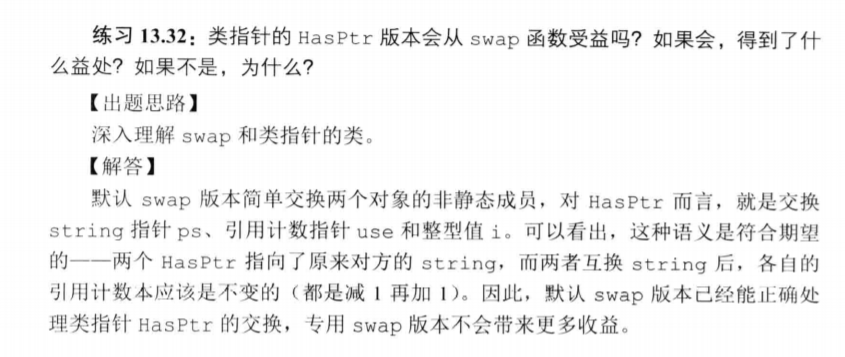

# 如何理解类值行为和类指针行为？
## 行为像值的类
为了提供类值的行为，对于**类管理的资源，每个对象都应该拥有一份自己的拷贝**。
```cpp
class HasPtr{
public:
    //some functions
private:
    std::string *ps;
    int i;
}
```
那么对于`HasPtr`类来说，为了实现类值行为，HasPtr需要：
- 定义一个拷贝构造函数，拷贝string的值，而不是拷贝指针。
- 定义一个析构函数来释放string
- 定义一个拷贝赋值运算符来释放对象当前的string，并从右侧对象拷贝string。

### 类值拷贝复制元素赋值运算符
&emsp;&emsp;赋值运算符通常**组合了析构函数和构造函数的操作**，类似析构函数，赋值操作会销毁左侧运算对象的资源。类似拷贝构造函数，赋值操作会从右侧运算对象拷贝数据。  
这些操作都是以正确的顺序执行的，即使将**一个对象赋予自身，也能保证正确**。


## 行为像指针的类
&emsp;&emsp;定义拷贝构造函数和拷贝赋值运算符，来拷贝**指针成员本身而不是它指向的string**。类仍需要自己的析构函数来释放接受string参数的构造函数分配的内存，但是不能单方面的释放关联的string，只有**最后一个指向string的HasPtr销毁时参考一释放string**。  
&emsp;&emsp;令一个类**展现指针的最好方法就是使用`shared+ptr`**来管理类中的资源，当没有用户使用对象时，`shared_ptr`类负责释放资源。

### 如何直接管理资源而不使用智能指针：
&emsp;&emsp;使用**引用计数**：
&emsp;&emsp;引用计数的工作方式如下：
- 除了初始化对象外，每个构造函数（拷贝构造函数除外）还要创建一个**引用计数**，用来记录多少对象**与正在创建的对象**共享状态，创建对象的时候将计数器初始化为1.
- 拷贝构造函数**不分配新的计数器**，而是拷贝给定对象的数据成员，包括计数器。拷贝构造函数递增共享的计数器，指出给定对象的状态又被一个新用户所共享。
- 析构函数递减计数器，只存储共享状态的用户少了一个。如果计数器变为0，则析构函数释放状态。

```cpp
class HasPtr{
public:
    HasPtr(const std::string &s=std::string()):ps(new std::string(s)),i(0),
        count(new std::size_t(1)){};
    HasPtr(const HasPtr &p):
        ps(p.ps),i(p.i),count(p,count){++*count;}
    HasPtr& operator=(const HasPtr &rhs){
        ++*rhs.count;
        if(--*count==0){
            delete ps;
            delete count;
        }
        ps=rhs.ps;
        i=rhs.i;
        count=rhs.count;
        return *this;
    }
    ~HasPtr(){
        if(--*count){
            delete ps;
            delete count;
        }
    }
private:
    std::string *ps;
    int i;
    //在构造函数中动态分配就可以啦
    std::size_t* count;
}
```

- 当拷贝或赋值一个HasPtr对象时，我们希望副本和原对象都指向相同的string。那么就考呗指针而非string值。

- 这里给出了一个合适的理解，如何理解指针类行为。


## 如何区分行为像指针的类与像值得类？
- 如果存在使用智能指针，或者有引用计数这个东西的话，就很明显是把类当作指针行为
- 如果对于每个资源都进行另行复制，那么就是希望这个类有值行为。、
- 当然，面对自己设计的类的时候，究竟是选择具有值行为还是指针行为，还是需要仔细分析才对。

## 一个Demo
- 这个demo是C++primer练习题13.28，要求如下，觉得这个很不错就拿过来用一下：  


  

- 这里个人觉得类值行为更为妥当，但是有一个问题：**如果自定义类含有指向自己类型的指针的话，是否不能有类值行为，而必须是类指针行为**？  
&emsp;&emsp;对于类值类型，指向自定义类型的指针不能直接把指针拷贝过去（拷贝指针不需要调用构造函数进行动态分配空间），而是需要进行动态分配一块内存，那动态分配的时候首先调用构造函数，构造函数同样需要对自己里面含有的指针成员调用构造函数，子子孙孙无穷尽也？所以如果含有指向自己类型的指针的话大概是不能有值类型行为的。  
```cpp
class listnode{
    listnode(int &s):value(s),next(nullptr),count(new int(0)){};
    listnode(const listnode& p):next(p.next),value(p.value){++*count;}
private:
    int *count;
    listnode* next;
    int value;
}

//表现为值类型的list类
class listnode{
    //如果有值行为就一定会有这一步，构造函数创建一个指向自己类型的指针
    //这个时候就需要重载一个空的构造函数，应付这种情况
    listnode():next(nullptr),value(0){};
    listnode(int &val):next(new listnode()),value(val){};
    listnode(const listnode& n):value(n.value){
        next=new listnode();
        //那这一步赋值时还是一个拷贝过程，需要调用对应的拷贝赋值运算符。
        //何必呢，而且拷贝出来一个值类型的此类是没有意义的。
        *next=*n.next;
    }
    listnode(int )
private:
    listnode* next;
    int value;
}
```
当然对于listnode这种，好像值类型是没有什么必要的，为什么要定义值类型呢？正如我复制了一个节点，但之后还有一大堆麻烦事在等着我都需要考虑。所以就不要这么做了。

# 动态内存管理类：
&emsp;&emsp;自定义一个`StrVec`类。记录一下一些使用到的新方法。  
## 一些新的类
### 1. Allocator类
&emsp;&emsp;所有C++标准库容器都具有一个默认为 allocator 的模板参数。通过使用自定义**分配器构造容器可控制该容器的元素的分配和释放**。  
&emsp;&emsp;例如，分配器对象可能会在私有堆上或共享内存中分配存储，或者可能针对小型或大型对象大小进行优化。 它可能还会通过它提供的类型定义靠指定通过管理共享内存或执行自动垃圾回收的特殊访问器对象访问元素。 因此，使用分配器对象分配存储的类应使用这些类型来声明指针和引用对象，这与 C++ 标准库中的容器所执行的操作一样。

#### 分配释放内存：
```cpp
allocator<int> alloc;
allocator<int>::pointer ptr;

//pointer allocate(size_t i)，分配i个对象的空间，对象类型已由this的类型指定
ptr=alloc.allocate(10);

int i;
for(i=0;i<10;i++){
    ptr[i]=i;
}
for(i=0;i<10;i++){
    cout<<ptr[i]<<ends;
}
//在释放的时候，指定
alloc.deallocate(ptr,10);
```
#### const_pointer 与const_reference
- 指针类型描述一个对象 ptr，该对象可通过表达式 *ptr 指定 allocator 可分配的对象类型的任何常量对象。
- 提供对由分配器管理的对象类型的常量引用的类型。
简单来说就是提供了两种引用语义。
```cpp
//接上一段代码，
vector<int>::const_reference ref;
//ptr为allocator<int>::const_pointer，vec中包含10个元素[0..10]
ptr=vec.begin();
//ref是对vec中第一个元素的绑定，现在ref为0
ref=ptr;
//对vec中的第一个元素进行修改，现在vec第一个的元素值为100，而不是刚开始的0
ref=100;
```

使用`const_pointer`和`const_reference` 可以有效的减少自己定义指针以及引用的类型，对于模板类的使用减少了出错机会。
#### construct()
在使用指定值初始化的指定地址出构造特定类型的对象。
```cpp
//ptr执行要构造对象位置的指针
//val初始化要构造对象的值
void construct(pointer ptr, const Type& val);
void construct(pointer ptr, Type&& val);
template <class _Other>
    void construct(pointer ptr, _Other&&... val);
```
#### deallocate()
- 从指定位置开始从存储中释放指定数量的的对象.  
- 成员函数通过调用 operator delete(ptr)，为从ptr开始 Type 类型的计数对象数组释放存储。 必须先通过对等于 *this的分配器对象调用allocate来返回指针ptr ，并分配大小和类型相同的数组对象。 deallocate 绝不会引发异常.
```cpp
void deallocate(pointer ptr, size_type count);
```

#### destory
调用对象析构函数而不释放存储对象的内存。
# 习题练习精选：
### 什么时候使用拷贝构造函数？
- 拷贝初始化，传递给非引用类型形参，**返回值为非引用类型**的对象，**初始化标准容器或调用push/insert操作的时候。
### 拷贝构造函数如何工作？
&emsp;&emsp;合成的拷贝构造函数逐个拷贝非const成员，对内置类型成员直接进行内存拷贝。对类类型成员调用其拷贝构造函数进行拷贝。

### 13.5 
```cpp
HasPtr(const HasPtr& org){
    i=org.i;
    ps=new string(*org.ps);
}
```
### 13.6
&emsp;&emsp;通常情况下，合成的拷贝赋值运算符会将右侧对象**非static成员诸葛赋予右侧对象的对应成员**。这些赋值操作是由成员类型的拷贝赋值运算符来完成的。
若未定义会自动合成。

### 13.8
&emsp;&emsp;赋值运算符和拷贝构造函数的写法就不太一样了，因为赋值运算符的左侧运算对象已经有值了，现在我需要把它的值给替换掉。
```cpp
HasPtr& operator=(const HasPtr& org){
    i=org.i;
    auto newps=new string(*org.ps);

    //这个是不是必须的呢？为什么不能进行重新赋值？
    delete ps;//构造函数里面这个指针是动态分配的
    ps=newps;
    return *this;
}
```

### 13.9
&emsp;&emsp;析构函数释放对象使用的资源，销毁非静态数据成员。合成的析构函数执行完后，非静态数据成员会被诸葛销毁。**成员是在析构函数体之后隐含的析构阶段中进行销毁的**。

### 13.12
下面代码片段产生几次析构函数调用：
```cpp
bool func(const Sale_data *trans,Sale_data accum){
    Sale_data item1(*trans),item2(accum);
    return item1.isbn()!=item2.isbn();
}
```
- item1与item2的析构函数调用
- ~~trans与~~accum的析构函数调用
&emsp;&emsp;虽然`trans`的生命周期也结束了，但它是一个指针，并不是**它指向的对象的生命期结束**，所以不会调用析构函数。

### 13.14
```cpp
//有一个类numbered为每个对象生成唯一的序号，保存在mysn中
//有一个函数：
void func(numbered s){cout<<s.mysn<<endl;}
numbered a,b=a,c=b;
func(a);
func(b);
func(c);
```
&emsp;&emsp;对以上的代码来说，如果定义了拷贝构造函数，那么输出的值就不会相同。但是注意**在函数实参与形参传递的时候调用了拷贝构造函数，形参这个临时对象被分配了新的值**。


### 13.32 默认的swap也很好用^_^，一般情况下不需要自己写
