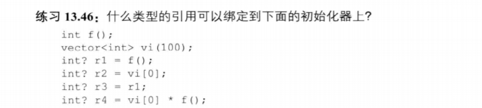
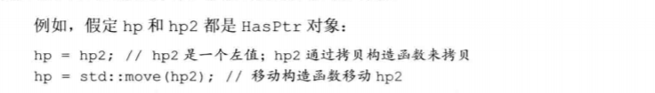
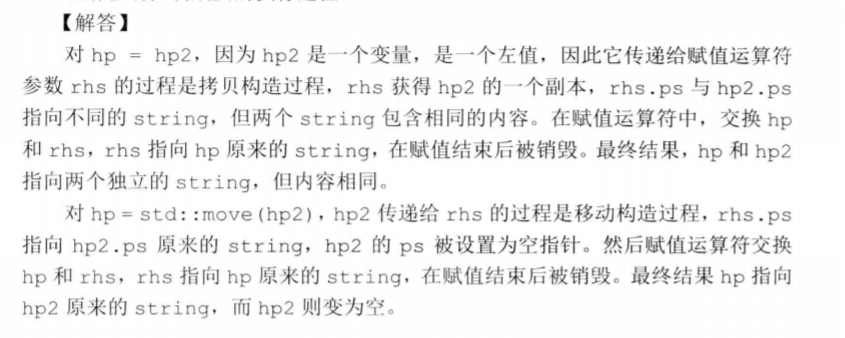
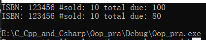
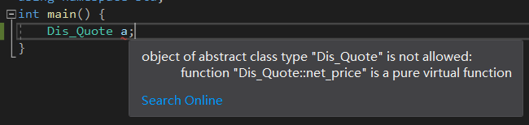

# Say Something
第13章的习题已经做完了，明天开始就开始做第15章的习题吧。对于继承这一块内容我写C++程序根本没有用过，在这里可以获得一些比较好的练习。

# 第13章：拷贝控制习题练习精选：
### 什么时候使用拷贝构造函数？
- 拷贝初始化，传递给非引用类型形参，**返回值为非引用类型**的对象，**初始化标准容器或调用push/insert操作的时候。
### 拷贝构造函数如何工作？
&emsp;&emsp;合成的拷贝构造函数逐个拷贝非const成员，对内置类型成员直接进行内存拷贝。对类类型成员调用其拷贝构造函数进行拷贝。

### 13.5 
```cpp
HasPtr(const HasPtr& org){
    i=org.i;
    ps=new string(*org.ps);
}
```
### 13.6
&emsp;&emsp;通常情况下，合成的拷贝赋值运算符会将右侧对象**非static成员诸葛赋予右侧对象的对应成员**。这些赋值操作是由成员类型的拷贝赋值运算符来完成的。
若未定义会自动合成。

### 13.8
&emsp;&emsp;赋值运算符和拷贝构造函数的写法就不太一样了，因为赋值运算符的左侧运算对象已经有值了，现在我需要把它的值给替换掉。
```cpp
HasPtr& operator=(const HasPtr& org){
    i=org.i;
    auto newps=new string(*org.ps);

    //这个是不是必须的呢？为什么不能进行重新赋值？
    delete ps;//构造函数里面这个指针是动态分配的
    ps=newps;
    return *this;
}
```

### 13.9
&emsp;&emsp;析构函数释放对象使用的资源，销毁非静态数据成员。合成的析构函数执行完后，非静态数据成员会被诸葛销毁。**成员是在析构函数体之后隐含的析构阶段中进行销毁的**。

### 13.12
下面代码片段产生几次析构函数调用：
```cpp
bool func(const Sale_data *trans,Sale_data accum){
    Sale_data item1(*trans),item2(accum);
    return item1.isbn()!=item2.isbn();
}
```
- item1与item2的析构函数调用
- ~~trans与~~accum的析构函数调用
&emsp;&emsp;虽然`trans`的生命周期也结束了，但它是一个指针，并不是**它指向的对象的生命期结束**，所以不会调用析构函数。

### 13.14
```cpp
//有一个类numbered为每个对象生成唯一的序号，保存在mysn中
//有一个函数：
void func(numbered s){cout<<s.mysn<<endl;}
numbered a,b=a,c=b;
func(a);
func(b);
func(c);
```
&emsp;&emsp;对以上的代码来说，如果定义了拷贝构造函数，那么输出的值就不会相同。但是注意**在函数实参与形参传递的时候调用了拷贝构造函数，形参这个临时对象被分配了新的值**。


### 13.32 默认的swap也很好用^_^，一般情况下不需要自己写


### 13.46:左值引用与右值引用的问题：
  

1. 右值引用，因为`f()`返回一个int类型的临时对象.
2. 左值引用，使用`[]`运算符返回元素的左值引用
3. 左值引用，**r1是一个变量，变量是左值**。
4. 右值引用，结果是一个右值


### 13.49 移动构造函数以及移动运算符    
这个一般比较简单
```cpp
class A{
public:
    A(A&& rhs){
        //把rhs的资源移动给左侧对象就可以了        
    };

    A& operator=(A&& rhs)noexcept;
}
```


### 13.52



# 第15章：面向对象程序设计
1. 什么是虚成员？  
用virtual修饰的成员，在继承类中~~可以~~被重写的成员叫做虚成员。
=>一般来说虚成员是基类希望虚成员在派生类中重新定义。除了构造函数外非static成员都可以为虚函数。
2. protected 访问说明符与private的区别：  
private只可以被本类中*对象在内部*访问。protected可以被继承类访问。
>这里描述的对象在内部访问，这个就很不准确了。因为在类内部访问private，protected的成员的内容其实就是类的成员。所以直接说成员就可以了。   
 
==>protected为受保护的访问标号，protected成员可以被该类的成员，友元和派生类成员（非友元）访问，而不可以被该类型的普通用户访问（这里的普通用户说的是对象）。而private成员只能被基类成员和友元访问。

5. 写一个Bulk_Quote类，继承Quote
想要重写virtual虚函数，那么就加上`override`关键字，这样就会自动帮助我们检查重写的是否正确。
```cpp
//函数接收一个Quote对象，然后调用此对象中的net_price()函数成员。
//会调用对应版本的函数，所谓多态即为此。
double print_total(std::ostream& os, const Quote& item, std::size_t n) {
	double ret = item.net_price(n);
	os << "ISBN: " << item.isbn() << " #sold: " << n << " total due: " << ret << endl;
	return ret;
}
int main() {
	Quote normal("123456", 10);
	Bulk_quete dis("123456", 10, 5, 0.2);
	print_total(cout, normal, 10);
	print_total(cout, dis, 10);

}
```


8. 给出静态类型和动态类型的定义：
- 静态类型：在编译时已经确定了，时变量声明时或表达式生成的类型。
- 动态类型是变量或表达式表示的内存中的对象的类型，动态类型直到运行时才能知道。
>如果一个变量无引用无指针，静态类型与动态类型一致。基类的指针或引用的动态类型可能与其动态类型不一致。动态类型决定了多态。

12. 有必要将一个成员函数同时声明为override和final嘛？
override表示此方法为重写的方法，final表示此方法为最后一个重写的，之后再继承的话不允许重写，只能使用这个函数。可以同时声明。

17. 创建一个抽象基类是否会报错，为什么？  
嗯很明显报了一个错误，因为抽象类中具有纯虚函数。那么可以认为C++中的接口可以通过抽象基类来实现。


25. 我们为什么为Dis_Quote（抽象基类）定义i一个默认构造函数？如果去掉构造函数的话会对Bulk_quote的行为产生什么影响？(继承链：Quote->Dic_Quote->Bulk_Quote)  
因为Dic_Quote的默认构造函数会运行Quote的默认构造函数,Quote的默认构造函数会完成成员的初始化工作。  
如果去掉该构造函数的话，Bulk_Quote的构造函数无法完成Dic_Quote的初始化工作。  

**每个类的数据成员由每个类的构造函数来初始化**，也就是说如果创建了一个派生类对象，那么为了初始化这个对象会调用继承链上的所有构造函数。如果没有构造函数那么就会在初始化链上中断。


# 第15章：Basket类的设计总结：
嗯说是总结，其实就是个批斗大会。代码还是别人的香，现在的水平还是差的有点远hh。

## 关于对multiset的遍历：
- multiset的迭代器：  
对于set，multiset来说，返回的迭代器全部为const iterator，不能通过迭代器修改所指向元素的值。因为这样会破坏已经组织好的数据结构。 

下面看一下我个人的版本，简直蠢到了极点，for里面调用函数不加参数列表，看看这是人干的事情嘛(/doge)??而且我理解的设计思路和本来的设计思路是有很大出入的，`Quote`对象中是没有表示有多少个相同的成员的。
```cpp
	//我的个人版本hhh，对于multiset这个对象的使用不是很熟练
	double total_receipt()const {
		double ret = 0.0;
		for (auto a : items) {
            //这里，net_price的参数列表呢？？
			ret += a->net_price;
		}
		std::cout << "The total in Basket are: " << ret << endl;
		return ret;
	}
```

## 设计思路：
> 首先我们定义了`Quote`类，表示一种购买情况。之后派生了很多类表示不同情况的折扣。然后其中有一个成员函数接受一个数量，然后计算出买这么多东西一共需要多少钱。  
>然后在设计Basket类的时候，我们把其中存储的每个元素认为是只买了一份。在集合中出现多少次就表示买了多少本。这也更方便操作，因为为了应对这种情况再加一个数据成员是毫无意义的，因为这个购买数目在别的情况下根本用不到。
>我们统计相同元素在集合里面出现的次数就可以了。这样更好设计。

## 隐藏指针
嗯之前的添加成员的函数接受的是一个智能指针，用户还必须要处理动态内存。这样不利于用户的使用，所以要重新定义函数，使它接受一个Quote对象而非一个智能指针。那么我们就可以进行一波模拟虚拷贝，加一个用来分配智能指针的函数就可以了。