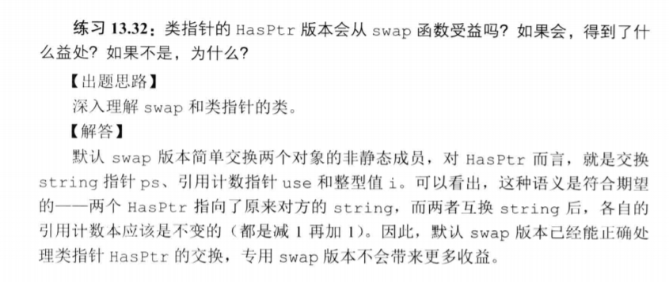

# Say Something
第13章的习题已经做完了，明天开始就开始做第15章的习题吧。对于继承这一块内容我写C++程序根本没有用过，在这里可以获得一些比较好的练习。

# 第13章：拷贝控制习题练习精选：
### 什么时候使用拷贝构造函数？
- 拷贝初始化，传递给非引用类型形参，**返回值为非引用类型**的对象，**初始化标准容器或调用push/insert操作的时候。
### 拷贝构造函数如何工作？
&emsp;&emsp;合成的拷贝构造函数逐个拷贝非const成员，对内置类型成员直接进行内存拷贝。对类类型成员调用其拷贝构造函数进行拷贝。

### 13.5 
```cpp
HasPtr(const HasPtr& org){
    i=org.i;
    ps=new string(*org.ps);
}
```
### 13.6
&emsp;&emsp;通常情况下，合成的拷贝赋值运算符会将右侧对象**非static成员诸葛赋予右侧对象的对应成员**。这些赋值操作是由成员类型的拷贝赋值运算符来完成的。
若未定义会自动合成。

### 13.8
&emsp;&emsp;赋值运算符和拷贝构造函数的写法就不太一样了，因为赋值运算符的左侧运算对象已经有值了，现在我需要把它的值给替换掉。
```cpp
HasPtr& operator=(const HasPtr& org){
    i=org.i;
    auto newps=new string(*org.ps);

    //这个是不是必须的呢？为什么不能进行重新赋值？
    delete ps;//构造函数里面这个指针是动态分配的
    ps=newps;
    return *this;
}
```

### 13.9
&emsp;&emsp;析构函数释放对象使用的资源，销毁非静态数据成员。合成的析构函数执行完后，非静态数据成员会被诸葛销毁。**成员是在析构函数体之后隐含的析构阶段中进行销毁的**。

### 13.12
下面代码片段产生几次析构函数调用：
```cpp
bool func(const Sale_data *trans,Sale_data accum){
    Sale_data item1(*trans),item2(accum);
    return item1.isbn()!=item2.isbn();
}
```
- item1与item2的析构函数调用
- ~~trans与~~accum的析构函数调用
&emsp;&emsp;虽然`trans`的生命周期也结束了，但它是一个指针，并不是**它指向的对象的生命期结束**，所以不会调用析构函数。

### 13.14
```cpp
//有一个类numbered为每个对象生成唯一的序号，保存在mysn中
//有一个函数：
void func(numbered s){cout<<s.mysn<<endl;}
numbered a,b=a,c=b;
func(a);
func(b);
func(c);
```
&emsp;&emsp;对以上的代码来说，如果定义了拷贝构造函数，那么输出的值就不会相同。但是注意**在函数实参与形参传递的时候调用了拷贝构造函数，形参这个临时对象被分配了新的值**。


### 13.32 默认的swap也很好用^_^，一般情况下不需要自己写


### 13.46:左值引用与右值引用的问题：
  

1. 右值引用，因为`f()`返回一个int类型的临时对象.
2. 左值引用，使用`[]`运算符返回元素的左值引用
3. 左值引用，**r1是一个变量，变量是左值**。
4. 右值引用，结果是一个右值


### 13.49 移动构造函数以及移动运算符    
这个一般比较简单
```cpp
class A{
public:
    A(A&& rhs){
        //把rhs的资源移动给左侧对象就可以了        
    };

    A& operator=(A&& rhs)noexcept;
}
```


### 13.52


